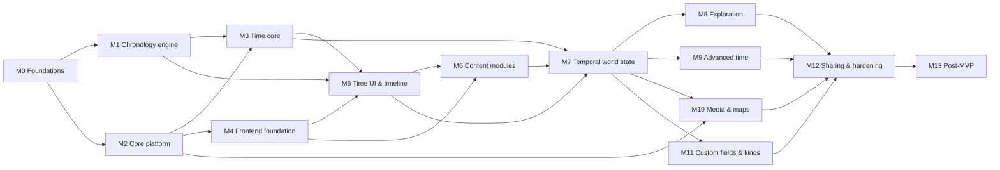

# Roadmap

The implementation plan as **14 milestones** (M0–M13) and **162 GitHub issues** in
[`Hidoni/lore-world-tracker`](https://github.com/Hidoni/lore-world-tracker/issues). M0–M12 are the
MVP (`docs/product/vision.md` §MVP definition). M13 is the post-MVP backlog, worked on only at the
product owner's request.

- **Status:** GitHub is the source of truth. `uv run tools/backlog.py stats` shows progress, and
  `uv run tools/backlog.py ready` shows what can be picked up now.
- **How to work an issue:** `docs/plan/workflow.md`.
- **Dependencies:** each issue body has a "Blocked by" line, mirrored as native GitHub
  "blocked by" relationships.

## Milestones

| MS | Goal | Exit criteria | Issues | Release |
|----|------|---------------|--------|---------|
| M0 Foundations | Scaffolds, Makefile, contract pipeline, security middleware, CI, Docker | `make check` and CI green; `docker compose up` serves the SPA shell | #1–#7 | – |
| M1 Chronology engine | Calendars, recurrence and correspondences in Python **and** TS; presets; viewport/ticks | Both engines pass 100% of the conformance vectors; differential fuzzing green | #8–#29 | – |
| M2 Core platform | Vaults, migrations, entities/fields/links, history, rich text, search, visibility framework, backups | Entities can be created, linked, searched, undone via API; leak harness running | #30–#43 | v0.1.0 |
| M3 Time core | Dimensions, timelines, calendars, anchors + propagation, events, recurrence, proposals, consistency | Full time model usable via API at cosmic scales within budgets | #44–#57 | v0.2.0 |
| M4 Frontend foundation | Shell, data layer, module framework, entity pages, editor, navigation, links, search, history, settings | Generic wiki usable in the browser; E5 green | #58–#71 | v0.3.0 |
| M5 Time UI & timeline view | Time pickers, dimension wizard, calendar editor + impact previews, events, recurrence UI, timeline view | E1–E4 green | #72–#88 | v0.4.0 |
| M6 Content modules | Misc, locations, species, characters, groups, languages + lexicon | All brief components usable | #89–#99 | v0.5.0 |
| M7 Temporal world state | Facts, existence, temporal links, as-of cursor, ages, narrative rules | E6 green | #100–#108 | v0.6.0 |
| M8 Exploration | Graph (global/local), visual linking, unlinked mentions | Graph of 10k nodes interactive | #109–#113 | v0.7.0 |
| M9 Advanced time | Branches, correspondences, worldlines, advanced rules | E7–E9 green | #114–#125 | v0.8.0 |
| M10 Media & maps | Uploads, galleries, image nodes; interactive time-aware maps | E10 green | #126–#132 | v0.9.0 |
| M11 Custom fields & kinds | Custom fields (incl. temporal), custom kinds, relation fields | E11 green | #133–#137 | v0.10.0 |
| M12 Sharing, backup & hardening | Read-only mode, leak audit, published snapshots, reader UI, perf + a11y passes | E12–E13 green; all budgets met | #138–#146 | **v1.0.0** |
| M13 Post-MVP | Static export, Markdown/JSON export, MCP, uncertainty ranges, … | (per issue) | #147–#162 | – |

## Milestone dependencies and parallel tracks

Milestones overlap: dependencies are tracked per issue, so work starts as soon as an issue's
blockers close, not when a whole milestone ends. Natural parallel tracks:

| Track | Starts after | Issues |
|-------|--------------|--------|
| **Backend scaffold → platform** | – | #1 → #5 → #30 … #43 |
| **Frontend scaffold** | – | #2 → #3 → #4 → #6 → #7 |
| **Chronology (Python)** | #3 | #8 → #9 → #10 … #22 |
| **Chronology (TS ports)** | each Python counterpart | #23 → #24 → #25 → #26/#27/#28 → #29 |
| **Time core backend** | #34 (entities) + #8 | #44 … #57 |
| **Frontend foundation** | #4 + #30 | #58 … #71 |
| **Time UI** | #59 + #25 + #46 | #72 … #88 |

**Critical path** (longest chain weighted by size, S=1 M=2 L=3 XL=5; 28 issues):
#2 → #3 → #8 → #9 → #10 → #11 → #12 → #13 → #14 → #16 → #18 → #46 → #47 → #48 → #50 → #51 →
#52 → #53 → #54 → #77 → #79 → #82 → #83 → #116 → #117 → #124 → #144 → #146.
The Python chronology engine, the time core backend, the calendar editor/recurrence UI and the
timeline view form the schedule's backbone. When several ready issues have equal priority, prefer
the one on this path.

## Risks and mitigations

| Risk | Mitigation |
|------|------------|
| Calendar/recurrence semantics drift between Python and TS | Conformance vectors, same-PR rule, differential fuzzing (#29) |
| Propagation or recurrence performance at scale | Budgets in `testing.md`, perf tests in #10/#39/#48/#51/#56, perf pass #144 |
| Visibility leaks in shared views | Leak harness from M2 (#40), audit (#139), published snapshots (#140) |
| Migration breakage of real vaults | Golden fixture vault per release, pre-migration backups, single-head rule |
| Timeline view complexity (BigInt, LOD, tiles) | Viewport math isolated and tested in #28. View split into four issues (#80–#83) |
| Scope creep from advanced time features | Core data structures from day one (ADR-0008); UI delivered late (M9) as modules |
| Parallel agents colliding | Claim label, single Alembic head check, regenerate-don't-merge for generated files (workflow §9) |

## Issue index

Generated from the backlog at planning time. **GitHub is the source of truth for status**. Run `uv run tools/backlog.py stats`. Keys (`M3-07`) appear at the bottom of every issue.

### M0: Foundations

| # | Key | Title | Size | Prio | Blocked by |
|---|-----|-------|------|------|------------|
| #1 | M0-01 | Backend scaffold: uv project, FastAPI app factory, settings, CLI, health/meta, quality tooling | M | P0 | – |
| #2 | M0-02 | Frontend workspaces scaffold: @lore/web (Vite, React, Tailwind, shadcn/ui, TanStack) and @lore/chronology skeleton | M | P0 | – |
| #3 | M0-03 | Makefile, dev orchestration and repository hygiene files | S | P0 | #1, #2 |
| #4 | M0-04 | API contract pipeline: OpenAPI export → TypeScript types + typed client, drift check | S | P0 | #3 |
| #5 | M0-05 | Security and request middleware baseline (host allowlist, CSRF header guard, security headers/CSP, request ids, logging) | M | P0 | #1 |
| #6 | M0-06 | CI workflow (GitHub Actions), e2e smoke harness and Dependabot | M | P0 | #4, #5 |
| #7 | M0-07 | Dockerfile, docker compose and container smoke test in CI | M | P0 | #6 |
| #167 | M0-08 | Adopt shadcn's cn package so shadcn components add without rewrites | S | P2 | – |

### M1: Chronology engine

| # | Key | Title | Size | Prio | Blocked by |
|---|-----|-------|------|------|------------|
| #8 | M1-01 | Chronology schemas: Pydantic models, JSON Schema export, TS type generation, conformance suite format and runners | L | P0 | #3 |
| #9 | M1-02 | Chronology numeric utilities in both engines: moments, sortable keys, rationals, floor ops, big-number display | M | P0 | #8 |
| #10 | M1-03 | Chronology (Py): calendar definition validation and compilation (templates, top patterns, exceptions, epochs) | L | P0 | #9 |
| #11 | M1-04 | Chronology (Py): moment ⇄ fields conversions for single-regime calendars | L | P0 | #10 |
| #12 | M1-05 | Chronology (Py): unit bounds, ordinals, from_ordinal and picker options | M | P0 | #11 |
| #13 | M1-06 | Chronology (Py): parallel cycles (weeks etc.) and intercalary exclusion semantics | M | P0 | #12 |
| #14 | M1-07 | Chronology (Py): eras, regimes (calendar reforms) and local anchors | L | P0 | #13 |
| #15 | M1-08 | Chronology (Py): astronomical overlays (moons, seasons) | S | P1 | #11 |
| #16 | M1-09 | Chronology (Py): calendar arithmetic (add with constrain/reject, diff with largest unit) | L | P0 | #14 |
| #17 | M1-10 | Chronology (Py): formatting (patterns, defaults, intercalary formats, spans, large numbers) | M | P0 | #14, #15 |
| #18 | M1-11 | Calendar preset library and instantiation with base-unit scaling | L | P0 | #16, #17 |
| #19 | M1-12 | Chronology (Py): recurrence I — rule validation, interval rules, simple calendar rules, keys, window expansion | L | P0 | #16 |
| #20 | M1-13 | Chronology (Py): recurrence II — filters, selectors and cycle frequencies (advanced rules) | L | P0 | #19 |
| #21 | M1-14 | Chronology (Py): recurrence III — counting, count limits, occurrence numbers, exclusions, occurrence_at | L | P0 | #20 |
| #22 | M1-15 | Chronology (Py): correspondence mapping math (piecewise rational, inverse, extrapolation, composition) | M | P1 | #9 |
| #23 | M1-16 | Chronology (TS): port compilation and moment ⇄ fields conversions | L | P0 | #11 |
| #24 | M1-17 | Chronology (TS): port ordinals, options, cycles, eras, regimes and overlays | L | P0 | #23, #14, #15 |
| #25 | M1-18 | Chronology (TS): port arithmetic, formatting and presets | L | P0 | #24, #18 |
| #26 | M1-19 | Chronology (TS): port recurrence (expand, occurrence, counting, occurrence_at) | L | P0 | #25, #21 |
| #27 | M1-20 | Chronology (TS): port correspondence mapping | S | P1 | #23, #22 |
| #28 | M1-21 | Chronology (TS): timeline viewport math and calendar tick generation | L | P0 | #25 |
| #29 | M1-22 | Chronology hardening: cross-engine differential fuzzing and performance benchmarks | M | P1 | #26, #27, #28 |

### M2: Core platform

| # | Key | Title | Size | Prio | Blocked by |
|---|-----|-------|------|------|------------|
| #30 | M2-01 | Vault manager: data directory, vault.json, registry, locks and per-vault database engines | L | P0 | #5 |
| #31 | M2-02 | Alembic migration framework: programmatic per-vault config, auto-upgrade with backups, lore db tooling | L | P0 | #30 |
| #32 | M2-03 | Core schema v1: entities, aliases, tags, links, link types, mentions + SortableBigInt and UUIDv7 conventions | M | P0 | #31 |
| #33 | M2-04 | Backend module framework: ModuleSpec, registries, per-vault enablement and the registry endpoint | L | P0 | #32 |
| #34 | M2-05 | Field system and entity CRUD (create/read/update/trash/restore/purge) with parent rules and optimistic concurrency | L | P0 | #33 |
| #35 | M2-06 | Entity listing, navigation tree, children, trash list and field value suggestions | M | P0 | #34 |
| #36 | M2-07 | Links and link types: core link types, custom link types, link CRUD and per-entity link queries | L | P0 | #34 |
| #37 | M2-08 | Changesets: history capture, recent changes feed, per-entity history and undo | L | P0 | #36 |
| #38 | M2-09 | Rich-text documents: node schema validation, text/mention extraction, mentions table, reader filtering | M | P0 | #34 |
| #39 | M2-10 | Search: FTS5 indexing (public/restricted columns, trigram), search and quick-switcher APIs, reindex | L | P0 | #38, #35 |
| #40 | M2-11 | Visibility policy framework (author/reader policies, effective visibility, as_reader) and leak-test harness | L | P0 | #39, #37 |
| #41 | M2-12 | Vault backup and restore: manual zip backups, scheduled backups with retention, restore into a new vault | M | P1 | #31 |
| #42 | M2-13 | Vault maintenance CLI: check (integrity + derived data), reindex, optimize | S | P2 | #39 |
| #43 | M2-14 | Release v0.1.0: sample world generator (initial), first golden fixture vault, changelog | M | P1 | #40, #41, #42 |

### M3: Time core

| # | Key | Title | Size | Prio | Blocked by |
|---|-----|-------|------|------|------------|
| #44 | M3-01 | Time specs storage, slot registry and the time_dependencies graph table | M | P0 | #34, #8 |
| #45 | M3-02 | Dimensions and prime timelines (time spec, duration limits, present moment) | M | P0 | #44 |
| #46 | M3-03 | Calendars: storage, compilation cache, presets & preview endpoints, dimension wizard | L | P0 | #45, #18 |
| #47 | M3-04 | Anchor resolution service (absolute, calendar, relative incl. calendar offsets) and /time endpoints | L | P0 | #46 |
| #48 | M3-05 | Dependency propagation engine: edges, cycle rejection, closure, topological re-resolution, hard checks, anchor freezing | L | P0 | #47 |
| #49 | M3-06 | TimelineView: generic lineage visibility and override resolution for time-bound tables | M | P0 | #45 |
| #50 | M3-07 | Events: model, CRUD with time specs, sub-events, causality, participants, event tree | L | P0 | #48, #49, #36 |
| #51 | M3-08 | Timeline window API: overlap queries, importance-based LOD, density buckets, tile-friendly responses | L | P0 | #50 |
| #52 | M3-09 | Recurring series: rule storage and validation, series bounds caching, occurrence expansion in windows | L | P0 | #51, #21 |
| #53 | M3-10 | Materialized occurrences: materialize, modify, cancel; occurrence anchors; sub-events of occurrences; window merging | L | P0 | #52 |
| #54 | M3-11 | Proposals: calendar edit impact preview/apply (keep dates / pin / constrain) and recurrence-rule reconciliation | L | P0 | #53 |
| #55 | M3-12 | Consistency engine framework, findings/suppressions API, precision-aware comparisons, core structural and event rules | L | P0 | #53 |
| #56 | M3-13 | Sample world generator: time data (dimensions, calendars, events, recurrences, anchors) and backend perf harness | M | P1 | #54, #55 |
| #57 | M3-14 | Release v0.2.0: time core complete (fixture vault, changelog) | S | P1 | #56, #230 |
| #222 | M3-15 | SortableBigInt renders literal binds triple-quoted (bug) | S | P2 | – |
| #224 | M3-16 | Report propagated time changes in write responses (affected.time_changed and moved entities) | S | P1 | #50 |
| #230 | M3-17 | Decide: should keep_key reset an occurrence's original_start_t (recurrence proposals)? | S | P1 | #54 |

### M4: Frontend foundation

| # | Key | Title | Size | Prio | Blocked by |
|---|-----|-------|------|------|------------|
| #58 | M4-01 | App shell, code-based routing skeleton, theming and the vault picker | L | P0 | #4, #30 |
| #59 | M4-02 | Data layer: DataSource/Mutations interfaces, HttpDataSource, bigint domain mappers, query keys, affected-based invalidation | L | P0 | #58, #34 |
| #60 | M4-03 | Frontend module framework (defineModule, extension points, activation) and the KindRegistry | M | P0 | #59, #33 |
| #61 | M4-04 | Generic entity page layout, header and create/delete/restore flows | L | P0 | #60 |
| #62 | M4-05 | Field renderers and editors for every field type, inline editing, autosave and revision-conflict handling | L | P0 | #61 |
| #63 | M4-06 | Rich-text editor I: TipTap setup, entityLink mark with [[ and @ suggestions, read-only renderer, autosave | L | P0 | #62, #38, #39 |
| #64 | M4-07 | Rich-text editor II: visibility blocks, callouts, slash menu, Markdown paste with [[Name]] resolution | M | P1 | #63 |
| #65 | M4-08 | Navigation sidebar (registry sections, trees, pinned, recent), breadcrumbs, entity lists and trash UI | L | P0 | #61, #35 |
| #66 | M4-09 | Links UI: relations panel, add-link dialog (types, roles, validity placeholder), backlinks and mentions panel | L | P0 | #62, #36 |
| #67 | M4-10 | Command palette (quick switcher + commands) and search results page | M | P1 | #65, #39 |
| #68 | M4-11 | History UI: per-entity history, recent changes feed, undo | M | P1 | #61, #37 |
| #69 | M4-12 | Settings UI: vault settings, module toggles, custom link types, backups | M | P1 | #62, #41, #36 |
| #70 | M4-13 | E2E harness fixtures and journey E5 (editor linking and backlinks) | M | P1 | #64, #66 |
| #71 | M4-14 | Release v0.3.0: frontend foundation (fixture vault, changelog) | S | P2 | #70, #67, #68, #69 |

### M5: Time UI & timeline view

| # | Key | Title | Size | Prio | Blocked by |
|---|-----|-------|------|------|------------|
| #72 | M5-01 | Frontend chronology integration: compiled-calendar cache, MomentDisplay, time context store, display-calendar switcher | M | P0 | #59, #25, #46 |
| #73 | M5-02 | Time inputs I: BigNumberInput, DurationPicker and TimePointPicker (calendar and absolute modes) | L | P0 | #72 |
| #74 | M5-03 | Time inputs II: relative anchors tab, EndSpecPicker and server-side resolution previews | M | P0 | #73, #48 |
| #75 | M5-04 | Dimension wizard and dimension overview page | L | P0 | #73 |
| #76 | M5-05 | Calendar editor I: structure editor (levels, templates, year patterns, exceptions, alignment), JSON tab, live preview | L | P0 | #73 |
| #77 | M5-06 | Calendar editor II: cycles, eras, regimes, overlays, formats editors + proposal flow with ImpactPreviewDialog | L | P0 | #76, #54 |
| #78 | M5-07 | Event pages and editing: dates in all calendars, create/edit, sub-events, causes/effects, participants, event outline | L | P0 | #74, #50, #66 |
| #79 | M5-08 | Recurrence editor and occurrence UI (materialize/modify/cancel, reconciliation dialog) | L | P0 | #78, #77, #26, #54 |
| #80 | M5-09 | Timeline view I: bigint viewport, time axis with calendar ticks, minimap, zoom/pan/fit/go-to-date | L | P0 | #72, #28 |
| #81 | M5-10 | Timeline view II: event lanes, item rendering with fuzzy edges, tile fetching with LOD and density, selection preview | L | P0 | #80, #51 |
| #82 | M5-11 | Timeline view III: recurring-series bands and occurrences, era bands, overlay strip, draggable time cursor line | M | P0 | #81, #79 |
| #83 | M5-12 | Timeline view IV: sub-event expansion and drill-in, direct editing interactions, filters and lane grouping | L | P0 | #82 |
| #84 | M5-13 | Causality view and event hierarchy navigation in the sidebar | M | P1 | #78 |
| #85 | M5-14 | Consistency UI: findings panel, entity/timeline badges, rule severity settings, save-anyway dialog | M | P1 | #55, #62 |
| #86 | M5-15 | Editor timeRef node: calendar-aware inline dates | S | P2 | #73, #64 |
| #87 | M5-16 | E2E journeys E1–E4 (dimension wizard → events → calendar edit → relative anchors → recurrence) | M | P1 | #75, #77, #79, #83 |
| #88 | M5-17 | Release v0.4.0: time UI and timeline view (fixture vault, changelog) | S | P2 | #87, #84, #85, #86 |

### M6: Content modules

| # | Key | Title | Size | Prio | Blocked by |
|---|-----|-------|------|------|------------|
| #89 | M6-01 | Module misc: kind, category field, children-of-any-kind panel, sidebar grouping | S | P0 | #65, #35 |
| #90 | M6-02 | Module locations: kind, fields, spatial link types, location tree view, events-here and residents panels | L | P0 | #66, #78 |
| #91 | M6-03 | Module species: kind, fields, species link types, members and descent panels, descent tree view | M | P1 | #66 |
| #92 | M6-04 | Module characters: kind, fields, relationship link types, relationships/affiliations/life panels | L | P0 | #66, #78 |
| #93 | M6-05 | Characters: family tree view (layout spike + implementation) | L | P1 | #92 |
| #94 | M6-06 | Module groups: kind, fields, membership/leadership/relations/territory link types, members/leaders/territory endpoints and panels | L | P0 | #66 |
| #95 | M6-07 | Groups: org chart view and membership timeline (Gantt) | M | P1 | #94 |
| #96 | M6-08 | Module languages: language and writing-system kinds, fields, link types, family tree, speakers panel | L | P0 | #66 |
| #97 | M6-09 | Lexicon backend: entries table, CRUD, alphabet-order collation, CSV import/export, search contributor | L | P0 | #96, #39 |
| #98 | M6-10 | Lexicon UI: virtualized lexicon table with inline editing, import wizard, IPA helper, lexiconRef editor node | L | P1 | #97, #64 |
| #99 | M6-11 | Release v0.5.0: content modules (fixture vault, changelog) | S | P2 | #89, #90, #91, #93, #95, #98 |

### M7: Temporal world state

| # | Key | Title | Size | Prio | Blocked by |
|---|-----|-------|------|------|------------|
| #100 | M7-01 | Temporal facts and time-point fields backend: storage, slots, timeline awareness, facts API | L | P0 | #48, #49 |
| #101 | M7-02 | As-of state resolution, existence semantics, the state endpoint and existence-aware lists | M | P0 | #100 |
| #102 | M7-03 | Temporal links: validity resolution, link slots, and as-of filtering in link/backlink queries | M | P0 | #101, #36 |
| #103 | M7-04 | Time cursor and as-of rendering across entity pages, lists, trees and module panels | L | P0 | #102, #72 |
| #104 | M7-05 | Temporal editing UI: fact history editor, lifespan (existence) editor, link validity editing | L | P0 | #103, #74 |
| #105 | M7-06 | Derived temporal displays: ages, elapsed time, relative to present, character life panel | M | P1 | #103 |
| #106 | M7-07 | Narrative consistency rules for core and content modules (existence-aware, precision-aware) | L | P1 | #102, #90, #91, #92, #94, #97 |
| #107 | M7-08 | E2E journey E6: relationships with validity, family tree, time cursor | S | P1 | #104, #93 |
| #108 | M7-09 | Release v0.6.0: temporal world state (fixture vault, changelog) | S | P2 | #105, #106, #107 |

### M8: Exploration

| # | Key | Title | Size | Prio | Blocked by |
|---|-----|-------|------|------|------------|
| #109 | M8-01 | Graph module backend: graph endpoint with filters, neighborhoods, as-of and truncation (set-based SQL) | L | P0 | #102, #40 |
| #110 | M8-02 | Global graph view: sigma.js + graphology with ForceAtlas2 worker, filters, styling, search, saved views | L | P0 | #109, #60 |
| #111 | M8-03 | Local graph panel on entity pages and visual linking (Alt+drag in graphs, drag participants onto timeline events) | M | P1 | #110, #83 |
| #112 | M8-04 | Unlinked mentions: detection endpoint and one-click linking | M | P2 | #66, #39 |
| #113 | M8-05 | Release v0.7.0: exploration (changelog) | S | P2 | #111, #112 |

### M9: Advanced time

| # | Key | Title | Size | Prio | Blocked by |
|---|-----|-------|------|------|------------|
| #114 | M9-01 | Branches backend I: branch creation, lineage across all time-bound tables, branch-only entities | L | P0 | #102, #53 |
| #115 | M9-02 | Branches backend II: override rows (events, facts, links, segments, series), diff endpoint, per-timeline notes | L | P0 | #114 |
| #116 | M9-03 | Branches UI I: timeline switcher, create-branch dialog, inherited badges, read-only shared past, "edit in this timeline" | L | P0 | #115, #83 |
| #117 | M9-04 | Branches UI II: timeline compare mode lanes, timeline entity pages, per-timeline notes | M | P1 | #116 |
| #118 | M9-05 | Correspondences backend: tables, sync-point slots, validation, mapping API with path composition | L | P0 | #48, #22 |
| #119 | M9-06 | Correspondences UI: editor with mapping chart, "concurrently in" sections, dimension lanes on the timeline | L | P1 | #118, #83, #27 |
| #120 | M9-07 | Worldlines backend I: segments, implicit worldlines, subjective time, presence and personal-timeline APIs | L | P0 | #101 |
| #121 | M9-08 | Worldlines backend II: time-travel wizard endpoint and participation segment assignment | M | P1 | #120, #114 |
| #122 | M9-09 | Worldlines UI: worldline panel, time-travel wizard, personal timeline view, jump layer, subjective ages | L | P1 | #121, #105, #83 |
| #123 | M9-10 | Advanced-time consistency rules and cross-dimension/subjective causality checks | M | P1 | #115, #118, #121 |
| #124 | M9-11 | E2E journeys E7–E9 (branch override, time traveler, cross-dimension display) | M | P1 | #117, #119, #122 |
| #125 | M9-12 | Release v0.8.0: advanced time (fixture vault, changelog) | S | P2 | #123, #124 |

### M10: Media & maps

| # | Key | Title | Size | Prio | Blocked by |
|---|-----|-------|------|------|------------|
| #126 | M10-01 | Media backend: content-addressed storage, validated uploads, thumbnails, safe serving, references, galleries, GC | L | P0 | #40, #41 |
| #127 | M10-02 | Media UI: image node with paste/drop upload, cover images, gallery panel, media library, media field editor | L | P1 | #126, #64 |
| #128 | M10-03 | Maps backend: maps and pins tables, APIs, time-aware pin visibility, map rules | L | P0 | #126, #90, #101 |
| #129 | M10-04 | Maps UI I: Leaflet viewer with pins, popovers, drill-down breadcrumbs, layers and time-cursor integration | L | P0 | #128, #103 |
| #130 | M10-05 | Maps UI II: map editing (place/move pins, child-location tray, per-pin validity and visibility) | M | P1 | #129 |
| #131 | M10-06 | E2E journey E10: map with pins, drill-down and time cursor | S | P1 | #130 |
| #132 | M10-07 | Release v0.9.0: media and maps (fixture vault, changelog) | S | P2 | #127, #131 |

### M11: Custom fields & kinds

| # | Key | Title | Size | Prio | Blocked by |
|---|-----|-------|------|------|------------|
| #133 | M11-01 | Custom fields backend: definitions CRUD, registry contribution, validation integration, safe type changes, archiving | L | P0 | #100, #33 |
| #134 | M11-02 | Custom kinds backend and convert-kind action | M | P1 | #133 |
| #135 | M11-03 | Custom fields and kinds UI: settings pages, icon picker, relation fields (custom link type sugar), generic rendering | L | P1 | #134, #69 |
| #136 | M11-04 | E2E journey E11: custom kind with custom (incl. temporal) fields | S | P1 | #135 |
| #137 | M11-05 | Release v0.10.0: custom fields and kinds (fixture vault, changelog) | S | P2 | #136 |

### M12: Sharing, backup & hardening

| # | Key | Title | Size | Prio | Blocked by |
|---|-----|-------|------|------|------------|
| #138 | M12-01 | Read-only server mode: mutation blocking, read-only vault opening, exposed vaults, reader policy everywhere | M | P0 | #40 |
| #139 | M12-02 | Visibility enforcement audit across all read paths and the complete canary leak suite (core + all modules) | L | P0 | #138, #128, #97, #121, #118, #109, #134, #115 |
| #140 | M12-03 | Published snapshots: publish sanitizer, CLI and settings action, module publish contributors, leak gate | L | P0 | #139 |
| #141 | M12-04 | Reader mode UI: no editing affordances, spoiler folding, reading layout (mobile-friendly), preview-as-reader toggle | L | P0 | #138, #64 |
| #142 | M12-05 | docker compose reader profile and sharing guide | S | P1 | #140, #7 |
| #143 | M12-06 | E2E journeys E12–E13 (publish + reader mode, backup + restore) | M | P1 | #141, #142 |
| #144 | M12-07 | Performance pass on the large sample vault against all budgets | L | P1 | #139, #124, #131 |
| #145 | M12-08 | Accessibility and UX polish pass (keyboard, focus, contrast, list alternatives, shortcuts) | M | P1 | #117, #130, #135 |
| #146 | M12-09 | MVP release 1.0.0: changelog, fixture vault, docs refresh, user guide | M | P0 | #143, #144, #145 |

### M13: Post-MVP backlog

| # | Key | Title | Size | Prio | Blocked by |
|---|-----|-------|------|------|------------|
| #147 | M13-01 | Static export: StaticDataSource, snapshot builder, client-side search, hash routing | XL | P2 | #140 |
| #148 | M13-02 | Markdown / Obsidian-compatible vault export | L | P2 | #140 |
| #149 | M13-03 | Portable JSON export/import (cross-version interchange, partial imports) | L | P2 | #146 |
| #150 | M13-04 | MCP server module: let AI assistants read (and optionally write) the vault safely | XL | P2 | #139 |
| #151 | M13-05 | Explicit uncertainty ranges for time points (earliest/latest) | L | P2 | #146 |
| #152 | M13-06 | Base-unit refinement tool (e.g. seconds → milliseconds) | M | P2 | #146 |
| #153 | M13-07 | Log-scale ("cosmic") timeline axis mode | M | P2 | #146 |
| #154 | M13-08 | Map territories over time (polygons linked to groups.controls) | L | P2 | #146 |
| #155 | M13-09 | Writing-system custom fonts (scripts module) | M | P2 | #146 |
| #156 | M13-10 | Recurrence by overlay phase and annual markers/seasons | M | P2 | #146 |
| #157 | M13-11 | Text date parsing for calendar inputs | M | P2 | #146 |
| #158 | M13-12 | Branch re-parenting and merging ("canonize a branch") | L | P2 | #146 |
| #159 | M13-13 | History compaction maintenance tool | S | P2 | #146 |
| #160 | M13-14 | Multi-pane / tabbed workspace (Obsidian-style) | L | P2 | #146 |
| #161 | M13-15 | SVG sanitization for inline rendering of uploaded SVGs | S | P2 | #146 |
| #162 | M13-16 | Deep-zoom tiling for very large map images | M | P2 | #146 |

## Requirement traceability

Requirement ids (`docs/product/requirements.md`) mapped to the issues whose bodies cite them.

| Requirement | Issues |
|-------------|--------|
| R-VLT-1 | #30, #58 |
| R-VLT-2 | #30 |
| R-VLT-3 | #41, #69 |
| R-VLT-4 | #69 |
| R-DIM-1 | #45, #75 |
| R-DIM-2 | #45, #75 |
| R-DIM-3 | #45, #75 |
| R-DIM-4 | #45, #75, #103 |
| R-DIM-5 | #46, #50, #75 |
| R-TIME-1 | #72 |
| R-TIME-2 | #47, #73, #74 |
| R-TIME-3 | #47, #73 |
| R-TIME-4 | #48 |
| R-TIME-5 | #54, #77 |
| R-TIME-6 | #16, #47 |
| R-TIME-7 | #48 |
| R-CAL-1 | #8, #46 |
| R-CAL-2 | #76 |
| R-CAL-3 | #76 |
| R-CAL-4 | #13, #76 |
| R-CAL-5 | #13, #77 |
| R-CAL-6 | #14, #77 |
| R-CAL-7 | #14, #77 |
| R-CAL-8 | #15, #77 |
| R-CAL-9 | #14, #46, #76, #77 |
| R-CAL-10 | #17, #77 |
| R-CAL-11 | #8 |
| R-CAL-12 | #18, #46, #75 |
| R-CAL-13 | #76 |
| R-CAL-14 | #17, #72 |
| R-EVT-1 | #50, #74, #78 |
| R-EVT-2 | #50, #53, #78, #83 |
| R-EVT-3 | #50, #78, #84 |
| R-EVT-4 | #50, #78 |
| R-EVT-5 | #50, #78 |
| R-EVT-6 | #78 |
| R-REC-1 | #19, #52 |
| R-REC-2 | #19, #20, #52, #79 |
| R-REC-3 | #19, #52, #79 |
| R-REC-4 | #21, #52, #79 |
| R-REC-5 | #21, #53, #79 |
| R-REC-6 | #21, #54, #79 |
| R-REC-7 | #82 |
| R-TL-1 | #45, #49, #114 |
| R-TL-2 | #49, #114, #115 |
| R-TL-3 | #114 |
| R-TL-4 | #115, #116, #117 |
| R-XD-1 | #22, #118, #119 |
| R-XD-2 | #119 |
| R-XD-3 | #22, #118 |
| R-WL-1 | #120, #121, #122 |
| R-WL-2 | #121, #122 |
| R-WL-3 | #120, #122 |
| R-WL-4 | #123 |
| R-ENT-1 | #34 |
| R-ENT-2 | #34, #61 |
| R-ENT-3 | #34, #61 |
| R-ENT-4 | #37, #68 |
| R-ENT-5 | #34 |
| R-LNK-1 | #36, #66, #100, #102, #104 |
| R-LNK-2 | #36, #69, #135 |
| R-LNK-3 | #38, #63, #66, #112 |
| R-LNK-4 | #83, #111 |
| R-TMP-1 | #101, #104 |
| R-TMP-2 | #100, #104 |
| R-TMP-3 | #101, #102, #103, #128 |
| R-TMP-4 | #105 |
| R-MOD-1 | #33, #69 |
| R-MOD-2 | #89 |
| R-LOC-1 | #90 |
| R-SPC-1 | #91 |
| R-CHR-1 | #92, #93 |
| R-GRP-1 | #94, #95 |
| R-LNG-1 | #96 |
| R-LNG-2 | #97, #98 |
| R-MSC-1 | #89 |
| R-MED-1 | #126 |
| R-MAP-1 | #128 |
| R-CST-1 | #133, #135 |
| R-CST-2 | #134, #135 |
| R-UI-1 | #35, #58, #65, #84 |
| R-UI-2 | #61, #63 |
| R-UI-3 | #28, #51, #80, #81, #82, #83, #117 |
| R-UI-4 | #109, #110, #111 |
| R-UI-5 | #84, #93, #95 |
| R-UI-6 | #67 |
| R-UI-7 | #58, #141, #145 |
| R-SRCH-1 | #39, #67 |
| R-CON-1 | #55, #85 |
| R-CON-2 | #55, #85, #106 |
| R-CON-3 | #55, #106, #123 |
| R-VIS-1 | #38, #40, #64, #139 |
| R-VIS-2 | #40, #141 |
| R-SHR-1 | #40, #138, #139, #142 |
| R-SHR-2 | #140 |
| R-SHR-3 | #147 |
| R-DAT-1 | #31 |
| R-DAT-2 | #8 |
| R-DAT-3 | #31 |
| R-DEP-1 | #7, #142 |
| R-DEP-2 | #1 |
| R-NFR-1 | #51, #81, #109, #144 |
| R-NFR-2 | #5, #126 |
| R-NFR-3 | #145 |
| R-NFR-4 | #2 |
| R-NFR-5 | #1, #2 |
